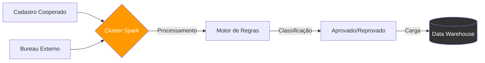

# Coop-Credit Engine: Pipeline de Risco de Crédito com Spark


> **Contexto:** Projeto de Engenharia de Dados desenvolvido para automatizar a análise de concessão e risco de crédito em uma Cooperativa, utilizando arquitetura distribuída e boas práticas de Engenharia de Dados (CI/CD, Testes Unitários e Modularização).

---

## 1. Problema de Negócio

Uma Cooperativa processa milhares de solicitações de empréstimo por dia. O processo manual atrasa aprovações, aumenta erros e não escala.

**Objetivo:** Criar um *Decision Engine* capaz de aprovar ou reprovar crédito em segundos, cruzando:
* Renda declarada
* Dívidas de mercado
* Restrições de bureaus externos

Tudo num pipeline confiável e totalmente automatizado.

---

## 2. Arquitetura do Sistema

Este projeto segue boas práticas de Engenharia de Software aplicadas a dados:
* **Código Modular:** Funções puras, testáveis e desacopladas do Airflow (`src/`).
* **Qualidade:** Testes unitários para validar lógica de crédito antes do deploy.
* **CI/CD:** GitHub Actions para validação contínua.
* **Infraestrutura:** Containers reproduzíveis (Spark + Airflow).

### Stack Tecnológica

* **Processamento:** Apache Spark (PySpark) – *compatível com Databricks*
* **Orquestração:** Apache Airflow 2.9
* **Infraestrutura:** Docker/JDK integrado
* **Qualidade:** Pytest + GitHub Actions

### Diagrama de Fluxo



---
## Regras de Concessão (Lógica de Negócio)
O motor de decisão aplica lógicas de negócio diretamente em Dataframes Spark:

 **1. Cálculo de Capacidade:** 
 O limite da parcela não pode exceder 30% da renda mensal.

 **2. Hard Rules (Reprovação Automática):**

    • Cliente com restrição ativa no Bureau Externo (SPC/Serasa).

    • Endividamento total de mercado superior a 10x a renda mensal.

 **Exemplo de Código Modularizado (src/transformations.py)**

```def aplicar_regras_credito(df):
    return df.withColumn(
        "status_analise",
        when(
            (col("restricao_spc") == "S") | 
            (col("divida_total_mercado") > (col("renda_mensal") * 10)), 
            lit("REPROVADO_RISCO")
        ).otherwise(lit("APROVADO"))
    )
```

## Estrutura do Projeto Profissional

```coop-credit-engine/
├── .github/workflows/   # Pipeline de CI/CD (GitHub Actions)
├── dags/                # Orquestração do Airflow
├── docs/                # Documentação e ADRs
├── src/                 # Código Fonte (Lógica Pura Spark)
├── tests/               # Testes Unitários Automatizados
├── docker-compose.yaml  # Infraestrutura como Código
├── Makefile             # Automação de comandos
└── README.md            # Documentação Geral
```

## Evidências de Execução

### 1. Pipeline de Dados (Airflow)
Fluxo completo de ingestão, processamento Spark e carga no DW executado com sucesso.


### 2. Resultado da Análise (Data Warehouse)
Consulta final demonstrando a aplicação das regras. Note que clientes com dívidas altas ou restrições foram automaticamente classificados como `REPROVADO_RISCO`.
        


## Como Executar

**1. Pré-requisitos**
 • Docker & Docker Compose

**2. Rodar o Pipeline Completo**
 docker-compose up --build

Acesse:
Airflow: http://localhost:8080

Login/Senha: airflow / airflow

**3. Rodar Testes sem Docker**
pip install -r requirements.txt
pytest tests/ -v


